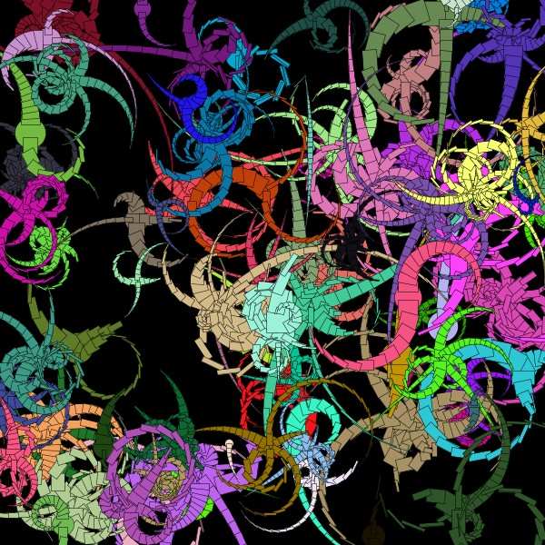

# NFTCreatures

Processing code for generating unique, images, usable as NFT tokens.
The images look like here in the example. None of the colors used in the images are used twice, so the images are guaranteed to be different.

[See all NFTCreatures](https://opensea.io/assets/nft-creatures)